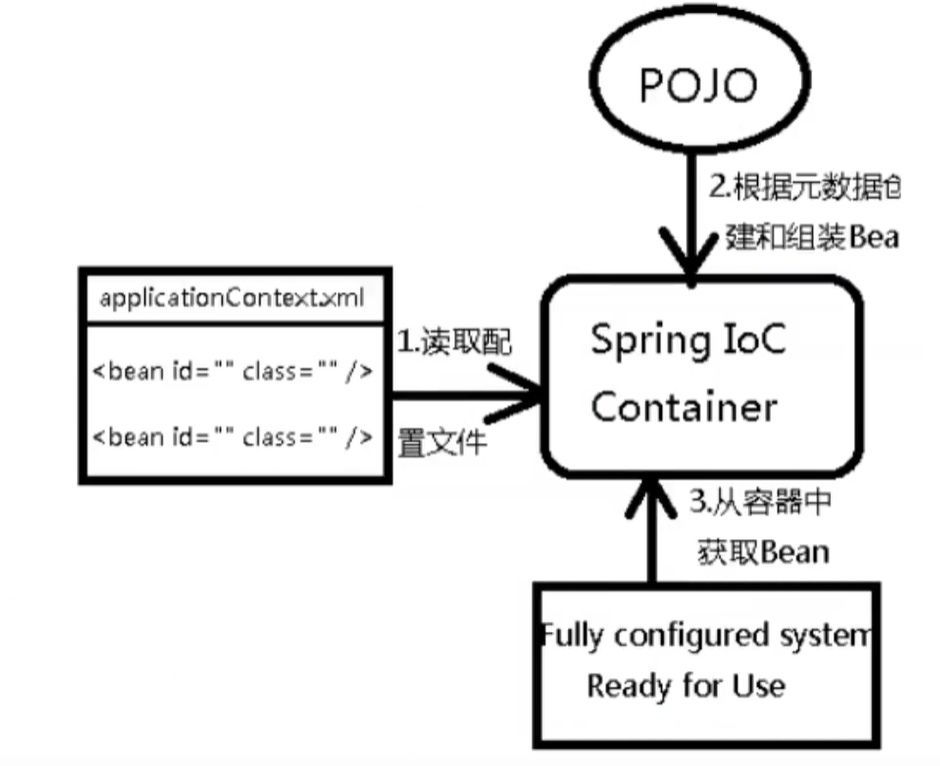

## 2.IOC
### 2.1 IOC理论推导
传统的做法
1.UserDao接口  
2.UserDaoImpl实现类  
3.UserService业务接口  
4.UserServiceImpl业务实现类  

在原来的业务中，用户的需求会可能影响我们的代码，我们需要根据用户的需求去修改源代码。如果程序代码量十分大，修改一次成本代价十分昂贵。  

我们使用了set接口实现。已经发生了革命性的改变。
```java
private UserDao userDao;
    public void setUserDao(UserDao userDao){
        this.userDao = userDao;
    }
```
- 之前，程序是主动创建对象，控制权在程序员的手里。  
- 使用set注入之后，程序不再具有主动性，而是变为被动的接受对象。  
- 这种思想从本质上解决了问题，我们程序员再也不用管理对象的创建了。系统的耦合性降低。
这是IOC的原型。


### 2.2 IOC的本质
控制反转loc（ Inversion of Contro），是一种设计思想，DI（依赖注入）是实现loC的一种方法，
也有人认为DI只是loC的另一种说法。没有loC的程序中，我们使用面向对象编程，对象的创建与对
象间的依赖关系完全硬编码在程序中，对象的创建由程序自己控制，控制反转后将对象的创建转移给
第三方，个人认为所谓控制反转就是：获得依赖对象的方式反转了.

IoC是 Spring框架的核心内容，使用多种方式完美的实现了IoC，可以使用XML配置，也可以使用注解，
新版本的 Spring也可以零配置实现IoC. Spring容器在初始化时先读取配置文件，根据配置文件或元数
据创建与组织对象存入容器中，程序使用时再从Ioc容器中取出需要的对象。

采用XML方式配置Bean的时候，Bean的定义信息是和实现分离的，而采用注解的方式可以把两者合为一体，
Bean的定义信息直接以注解的形式定义在实现类中，从而达到了零配置的目的。  

控制反转是一种通过描述（XML或注解）并通过第三方去生产或获取特定对象的方式。
在 Spring中实现控制反转的是loC容器，其实现方法是依赖注入（ Dependency Injection,ID）。


