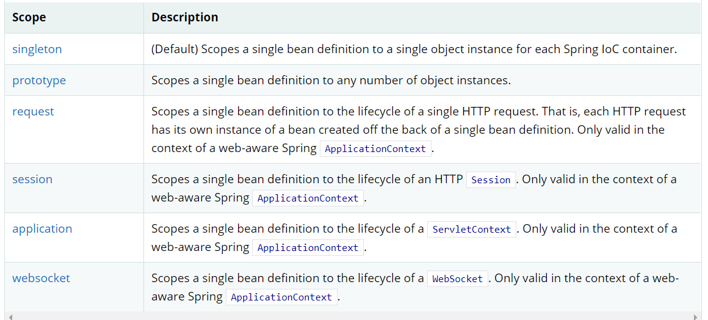

## 6.DI依赖注入
### 6.1 构造器注入（上面讲过了）  
### 6.2 set注入（重点）
- 依赖注入
    - 依赖：bean对象的创建依赖于容器
    - 注入：bean对象的所有属性，由容器来注入  
    
### 6.3 其他注入
c 与 p两种命名空间的注入方式

### 6.4 bean的作用域

1.单例模式（默认机制）  
2.原型模式：每次从容器中getBean的时候都会产生新对象！  
3.其余的request，session，application这些只能在web开发中使用

