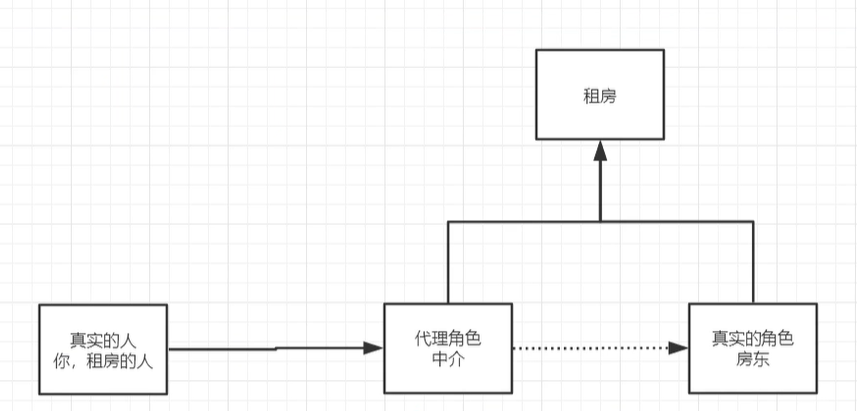
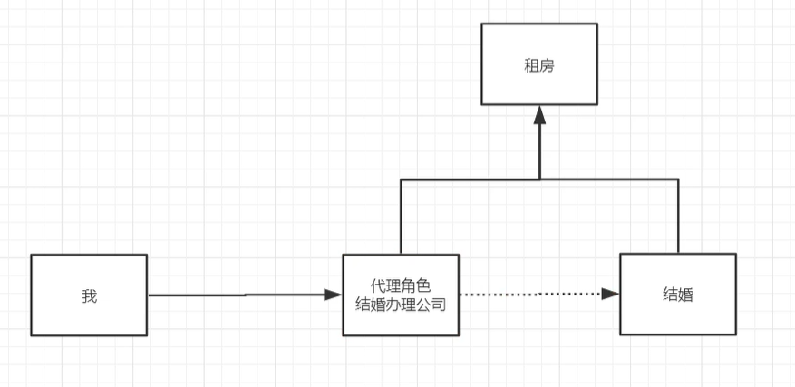
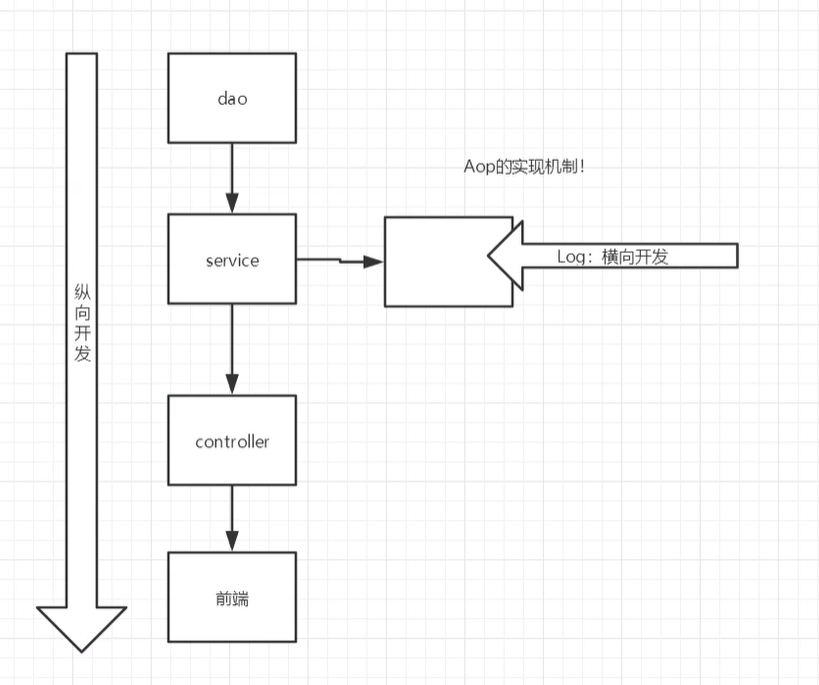

## 10.代理模式
#### 10.1为什么要学习代理模式？  
因为SpringAOP的底层【SpringAOP与SpringMVC】  
代理模式的分类：  
- 静态代理
- 动态代理  
#### 10.2什么是代理模式？

拿现实生活中租房的事情来说，一开始不存在中介的时候。你去租房子你要去一个一个的找房子信息，找房东信息，
还要签合同等操心乱七八糟等琐碎的事情。而房东也需要贴小广告发出租房信息，签个合同，收水电网费等琐碎。
为了解决这些痛点就诞生了中介，租房者与房东之间只要去找中介就行了，两者不需要去操心其他琐碎的事情。

在那现实生活中的婚庆公司来举例子。我只是想结个婚，但是以前传统的时候，我需要去操办其他的一切琐事，联系饭店、
请主持人、还要去租婚车、发请帖联系朋友等等。现在有了婚庆公司，这些事情都不需要了，而我只需要结个婚就行了。

#### 10.3静态代理模式
角色分析：
- 抽象角色：一般会使用接口或者抽象类来解决
- 真是角色: 被代理的角色
- 代理角色：代理真是角色，代理真实角色后，我们一般会做一些附属操作
- 客户：访问代理对象的人  

代码步骤：
- 1.接口
```java
// 出租
public interface Lease {
    public void lease();
}

```
- 2.真实角色
```java
//房东
public class Host implements Lease {
    public void lease() {
        System.out.println("房东出租房");
    }
}

```
- 3.代理角色

```java
public class Proxy implements Lease {
    private Host host;

    public Proxy(){
    }

    public Proxy(Host host) {
        this.host = host;
    }

    public void lease() {
        host.lease();
    }

    //看房
    public void seeHouse(){
        System.out.println("中介带你看房");
    }
    //签合同
    public void contract(){
        System.out.println("中介引导签合同");
    }
    //收中介费
    public void fare(){
        System.out.println("中介收中介费");
    }
}
```
- 4.客户端访问代理模式
```java
    public static void main(String[] args) {
        // 代理的方式
        // 代理一般有其他的附属操作，就是我们所谓的琐事
        Host host = new Host();
        Proxy proxy = new Proxy(host);
        proxy.lease();
    }
```


代理模式的好处：
- 可是使真实角色操作更加纯粹，不用去关注一些公共的业务 
- 公共的业务交给代理来做
- 公共业务发生拓展时，方便集中管理  

缺点：一个真实的角色就会产生一个代理角色，代码量会翻一倍。


AOP的原理
#### 10.4动态代理模式
- 动态代理与静态代理角色一样
- 动态代理的代理类是动态生成的，不是我们直接写好的
- 动态代理分为两大类：基于接口的动态代理，基于类的动态代理
    - 基于接口----JDK动态代理（重点）
    - 基于类----cglib
    - java字节码实现----javasist

需要了解两个类：Proxy与InvocationHandler  
Proxy代理, InvocationHandler调用处理程序

Proxy类是生成动态代理实例的. 提供用于创建动态代理类和实例的静态方法。
InvocationHandler是调用程序并返回结果的.

优点:
1. 静态代理的优点它都有
2. 一个动态代理类代理的是一个接口, 一般就是对应的一类业务
3. 一个动态代理类可以代理n多类, 只要是实现了接口即可.


