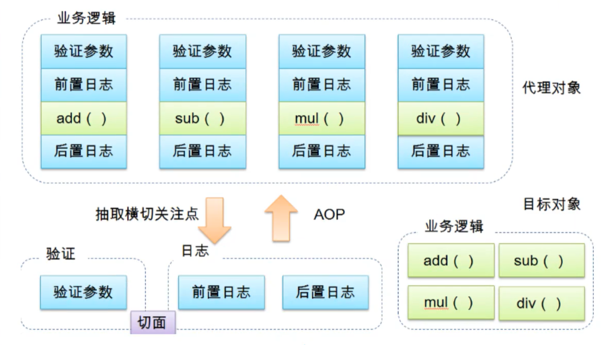
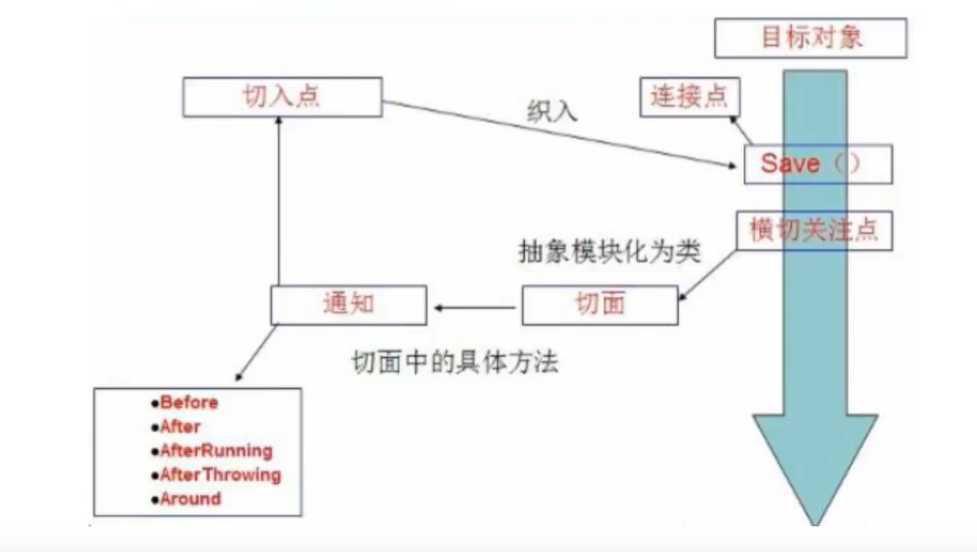
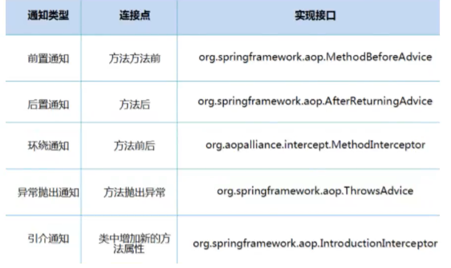

## 11.AOP
#### 11.1 什么是AOP?
AOP(Aspect Oriented Programming)面向切面编程, 通过**预编译方式和运行期动态代理**实现程序功能的统一维护的一种技术.
AOP是Spring中的一个重点, 是函数式编程的一种衍生泛型. 利用AOP可以对业务逻辑的各个部分进行隔离, 从而使得业务逻辑各部分
之间的耦合度降低, 提高程序的可重用性, 同时提高开发的效率.      
Spring中实现AOP的底层的两种方式:JDK与cglib. 可以通过proxy-target-class="true/false"来切换
  
#### 11.2 Aop在Spring中的作用
提供声明式事物: 允许用户自定义切面 
- 横切关注点:跨越应用程序多个模块的方法和功能. 即, 与我们的业务无关, 但这是我们需要关注的部分, 就是很横切关注点, 
比如: 日志, 安全, 缓存, 事务.
- 切面(Aspect): 横切关注点被模块化的特殊对象. 即, 它是一个类. 比如, 一个日志类.
- 通知(Advice): 切面必须要完成的工作. 即, 它是类的一个方法. 比如, 日志类中的方法.
- 目标(Target): 被通知的对象. 
- 代理(Proxy): 向目标对象应用,通知之后创建的对象
- 切入点(PointCut): 切面通知执行的"地点"定义.
- 连接点(JointPoint): 与切入点
  
Spring AOP中, 通过Advice定义横切逻辑, Spring中支持5种类型的Advice:  

#### 11.3 Spring中用AOP
方式一:使用Spring的接口  
方式二:自定义来实现AOP  
方式三:使用注解的方式实现AOP

