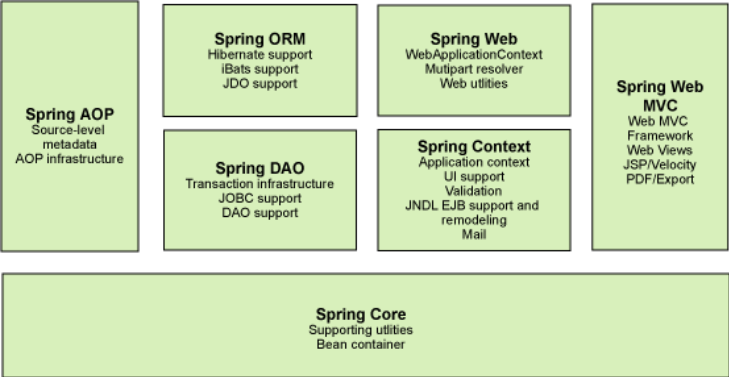
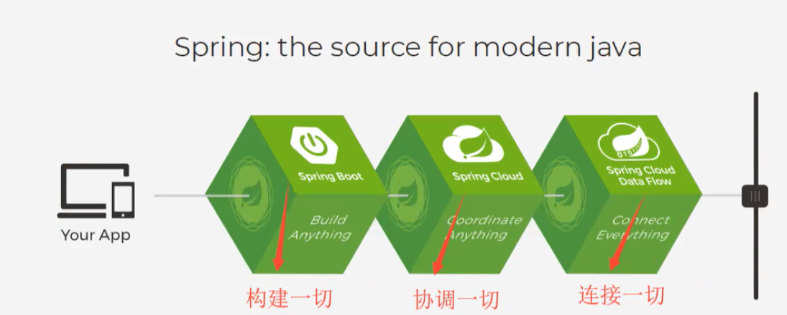

# Study Spring from scratch
## 1.Spring
### 1.1 简介
Spring理念：解决企业应用开发的复杂性而生。使现有技术更加容易使用，本身是一个大杂烩，整合了所有的技术框架。
### 1.2 优点
总结一句话，Spring就是一个轻量级的控制反转(IOC) 和面向切面编程(AOP)的框架
### 1.3组成

### 1.4拓展
现代Java开发说白了就是基于Spring的开发

- Spring boot 
    - 一个快速开发的脚手架
    - 基于SpringBoot可以快速开发单个微服务
    - 约定大于配置
    - **Spring的弊病，发展太久之后，违背了原来的理念，配置十分繁琐。“配置地狱”。所以就出现了SpringBoot**
- Spring Cloud
    - SpringCloud是基于SpringBoot实现的
   
